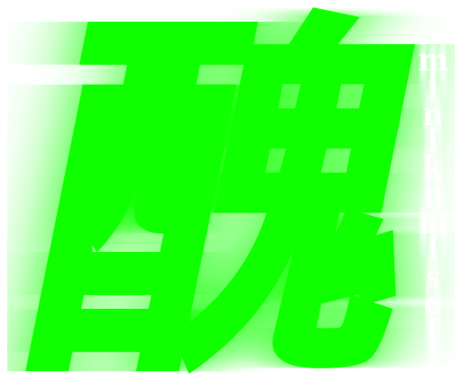

# English 🇬🇧
 
  

  
  <h3 align="center">Touhou-like bullet-hell engine writed in C#</h3>
  
I'm don't know what to put here

  
This engine uses Raylib-cs for graphics

  

  
<b>DISCLAIMER:</b> this is not professional software for making games. There's(i think) many shitcode and bad choices. This project will be updating(maybe)

 

# Українська 🇺🇦
 
  

  
  <h3 align="center">Тохо-подібний куле-пекельний ігровий рушій написаний на С#</h3>
  
Я не знаю що сюди вставляти

  
Цей двигун використовує Raylib-cs для промальовки

  

  
<b>УВАГА:</b> Це не професійний застосунок для вирбництва ігор. Тут є(я думаю) багато лайновок(лайно-коду) та поганих мислень(ідей). Цей проєкт буде оновлюватися(мабуть)

 

## Made by
 
	
 
